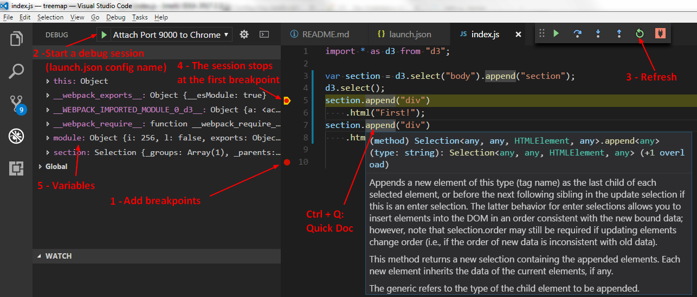

# Create D3 App

## Introduction
This project is an attempt to create an dev environment for D3.

A dev environment must deliver:
  * API documentation (of the dependency library)
  * debugger capability
  * hot reloading (no need to hit F5 to refresh the page)


## Pre-requisites

### Webpack Dev Server

Start the WebPack Dev Server

```bash
npm start
```
```
webpack: Compiling...
10% building modules 0/1 modules 1 active D:\myProject\src\index.js
10% building modules 1/1 modules 0 active
71% sealing
74% module optimization
82% module reviving
84% module id optimization
88% hashing
94% asset optimization
Hash: f57d1a6ecd3032571b64
Version: webpack 3.6.0
Time: 333ms
2 assets
[252] (webpack)/hot nonrecursive ^\.\/log$ 170 bytes {0} [built]
[256] ./src/index.js 188 bytes {0} [built]
    + 545 hidden modules
webpack: Compiled successfully.
```

  * A page must be available at http://localhost:9000

### Chrome

  * Close All chrome instance (You may kill them all)
  * Start chrome in debugging mode

```bash
chrome.exe --remote-debugging-port=9222
```

## Features
### Library documentation
TypeScript type declaration (typings) files (for example node.d.ts) are used in an IDE to provide third library API documentation.

  * Visual Studio Code (VsCode) - [Automatic Type Acquisition (ATA)](https://code.visualstudio.com/docs/languages/javascript#_automatic-type-acquisition)
  * Intellij IDEA - Settings / Javascript / Libraries / Download

### Debugger Capability


With Visual Studio Code (VsCode)



### Hot Reloading

The WebPack dev server has a live reloading capability.
Each time that 
